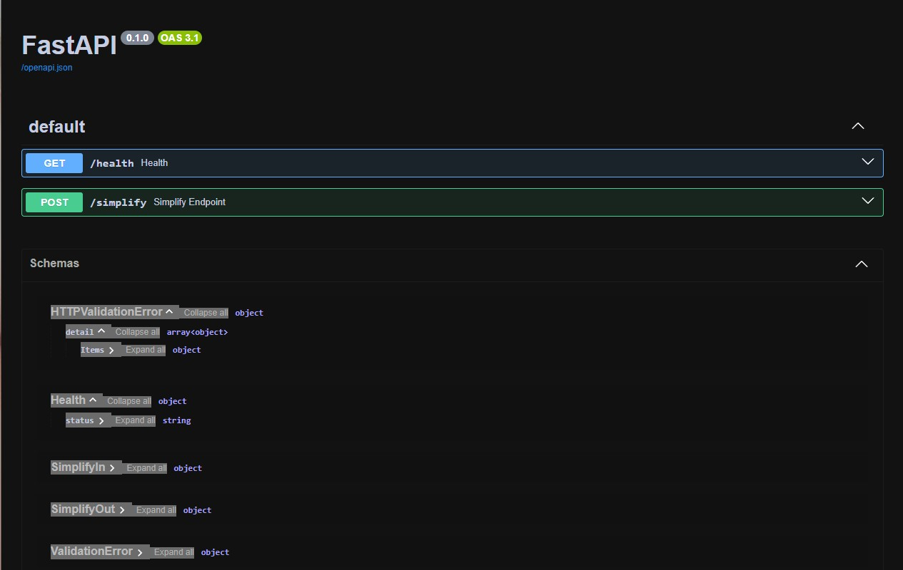

# Mini Mathway (Portfolio Version)

A minimal **FastAPI + SymPy** project that demonstrates symbolic math operations through an API.  
This project is designed as a **portfolio piece** to showcase skills in API design, testing, and CI/CD integration.

---

fastapi
uvicorn[standard]
httpx
pytest
pytest-cov
coverage-badge

## 🚀 Tech Stack
- **Language**: Python 3.11  
- **Framework**: FastAPI  
- **Math Engine**: SymPy  
- **Testing**: pytest + pytest-asyncio + httpx  
- **CI/CD**: GitHub Actions (automated testing)  
- **Dependency Management**: pip + requirements.txt  

---

## ✅ Implemented Endpoints

### `GET /health`
Health check endpoint to verify the API is running.

**Response:**
~~~json
{"status": "ok"}
~~~

---

### `POST /simplify`
Simplify a mathematical expression.

**Request:**
~~~json
{"expression": "2*x + 3*x"}
~~~

**Response:**
~~~json
{"result": "5*x"}
~~~

---

## 📸 Screenshots

**Swagger UI**  

**Health Check**  

## 🧪 Testing

Run locally:
~~~bash
pytest -q
~~~

**Sample output:**
~~~text
2 passed in 0.15s
~~~

---

## 🔧 How to Run

Clone the repository:
~~~bash
git clone https://github.com/YOUR_USERNAME/mini-mathway-portfolio.git
cd mini-mathway-portfolio
~~~

Start the API:
~~~bash
uvicorn main:app --reload
~~~
---

## 🛠️ Future Enhancements
Planned extensions to approach the functionality of Mathway:
- `/evaluate`: numeric evaluation with variable substitution  
- `/solve`: equation solving (linear, quadratic, systems)  
- `/factor` & `/expand`: factorization and expansion  
- `/derivative` & `/integral`: calculus (derivatives & integrals)  
- Step-by-step solution explanations for educational use  

---

## 📚 Key Takeaways
- Built and tested an API combining **FastAPI** and **SymPy**  
- Learned asynchronous testing with **pytest-asyncio**  
- Set up **CI/CD pipelines** with GitHub Actions  
- Maintained a clean and professional repository (template repo, `.gitignore`, test coverage)  

---

## 📜 License
This project is licensed under the MIT License – see the [LICENSE](./LICENSE) file for details.  

